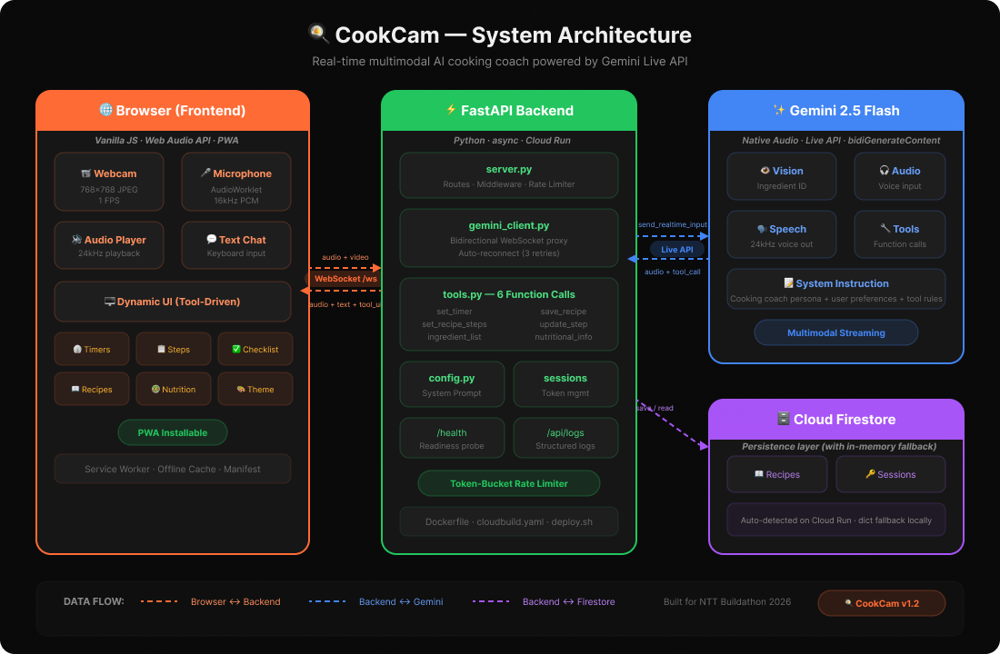

# 🍳 CookCam — Live AI Cooking Coach

**Real-time AI cooking assistant** that sees your kitchen through your webcam and guides you step-by-step through natural voice conversation.

Built with **Gemini Live API** for multimodal real-time interaction (vision + audio).


---

## ✨ Features

- **🎥 Ingredient Scanner** — Point your camera, AI identifies ingredients in real-time
- **🗣️ Voice Interaction** — Natural conversation with interruption support
- **📋 Recipe Suggestions** — Get recipe ideas based on visible ingredients
- **👨‍🍳 Live Cooking Guide** — Step-by-step voice instructions as you cook
- **👁️ Real-time Feedback** — "Those look perfectly golden, time to flip!"
- **🔄 Substitutions** — "I don't have cumin" → suggests alternatives
- **⚠️ Safety Alerts** — Proactive food safety warnings

## 🏗️ Architecture



```
Browser (Webcam + Mic)
    ↕ WebSocket (binary PCM audio + base64 JPEG video frames)
FastAPI Backend (server.py)
    ↕ Gemini Live API (send_realtime_input / receive)
Gemini 2.5 Flash Native Audio
    → Audio responses + Text + Function Calls (tool use)
        ↕
Cloud Firestore (recipes + sessions persistence)
```

**Key data flows:**
- **Browser → Backend → Gemini**: Webcam frames (768×768 JPEG, 1 FPS) + microphone audio (16kHz PCM) streamed over WebSocket
- **Gemini → Backend → Browser**: Voice responses (24kHz PCM) + text + function calls (timers, recipes, checklists) routed back in real time
- **Backend ↔ Firestore**: Saved recipes and session tokens persisted (with automatic in-memory fallback)
- **Function Calling**: Gemini proactively invokes 6 tools → backend executes them → UI updates sent to browser → results returned to Gemini

## 🚀 Quick Start

### Prerequisites

- Python 3.10+
- A Google AI API key ([Get one here](https://aistudio.google.com/apikey))

### Local Setup

1. **Clone and navigate:**
   ```bash
   cd ntt
   ```

2. **Install dependencies:**
   ```bash
   pip install -r requirements.txt
   ```

3. **Set your API key:**
   ```bash
   # Copy the template
   cp .env.example .env

   # Edit .env and add your key
   GEMINI_API_KEY=your-actual-api-key
   ```

4. **Run the server:**
   ```bash
   python server.py
   ```

5. **Open in Chrome:**
   ```
   http://localhost:8080
   ```

6. **Allow camera & microphone** when prompted, then click **Start Session**!

### Google Cloud Run Deployment

#### Option A: One-command deploy script ([`deploy.sh`](deploy.sh))
```bash
# Make executable (first time only)
chmod +x deploy.sh

# Deploy with defaults
./deploy.sh

# Or override project/region
./deploy.sh --project YOUR_PROJECT_ID --region us-central1
```

The script automatically:
- Loads `GEMINI_API_KEY` from `.env`
- Enables required GCP APIs (Cloud Run, Cloud Build, Artifact Registry)
- Builds the Docker image from source
- Deploys to Cloud Run with optimized settings (3600s timeout for WebSockets, 512Mi memory)
- Prints the live HTTPS URL

#### Option B: CI/CD with Cloud Build ([`cloudbuild.yaml`](cloudbuild.yaml))

Automated pipeline that runs on every push to `main`:

```bash
# One-time: create the trigger
gcloud builds triggers create github \
  --repo-name=ntt --repo-owner=YOUR_GITHUB_USER \
  --branch-pattern="^main$" \
  --build-config=cloudbuild.yaml
```

The pipeline (defined in [`cloudbuild.yaml`](cloudbuild.yaml)):
1. **Builds** the Docker image and tags it with the commit SHA
2. **Pushes** to Artifact Registry
3. **Deploys** to Cloud Run with all production settings

#### Option C: Manual deploy
```bash
gcloud config set project YOUR_PROJECT_ID

gcloud run deploy cookcam \
  --source . \
  --port 8080 \
  --allow-unauthenticated \
  --set-env-vars GEMINI_API_KEY=your-key \
  --region us-central1 \
  --timeout 3600
```

### Firestore Setup (Optional)

Recipes and sessions persist automatically on Cloud Run (Firestore is auto-detected).

For **local development** with Firestore:
1. Create a Firestore database in your GCP project (Native mode)
2. Set credentials:
   ```bash
   export GOOGLE_CLOUD_PROJECT=your-project-id
   export GOOGLE_APPLICATION_CREDENTIALS=/path/to/service-account.json
   ```

To **skip Firestore** and use in-memory storage, set:
```bash
export FIRESTORE_DISABLED=true
```

## 🛠️ Tech Stack

| Component | Technology |
|-----------|-----------|
| **AI Model** | Gemini 2.5 Flash Native Audio (Live API) |
| **Backend** | Python, FastAPI, WebSockets |
| **Frontend** | Vanilla HTML/CSS/JS, Web Audio API, AudioWorklet |
| **Cloud** | Google Cloud Run |
| **Storage** | Cloud Firestore (with in-memory fallback) |
| **SDK** | Google GenAI Python SDK |

## 📁 Project Structure

```
ntt/
├── server.py                 # FastAPI backend + Gemini Live API proxy
├── requirements.txt          # Python dependencies
├── Dockerfile                # Cloud Run container
├── cloudbuild.yaml           # CI/CD pipeline — automated build & deploy
├── deploy.sh                 # One-command deploy script
├── .env.example              # Environment template
├── README.md
├── api/
│   ├── gemini_client.py      # Gemini Live API WebSocket client
│   ├── tools.py              # Gemini function-call tool declarations & handlers
│   ├── firestore_client.py   # Firestore persistence (recipes, sessions)
│   ├── rate_limiter.py       # Token-bucket rate limiter
│   └── session_store.py      # Session management (Firestore-backed)
├── core/
│   └── config.py             # API keys, model config, system prompt
├── utils/
│   └── logger.py             # Structured logging
└── static/
    ├── index.html            # Main web page
    ├── css/styles.css        # Premium dark theme
    ├── js/app.js             # Frontend logic (WebSocket, webcam, audio)
    └── audio-processor.js    # AudioWorklet for PCM mic capture
```

## 🎯 How It Works

1. **Camera** captures video at 768×768 JPEG, sent at 1 FPS to Gemini
2. **Microphone** captures audio, downsampled to 16kHz PCM via AudioWorklet
3. **FastAPI** proxies both streams to Gemini Live API via WebSocket
4. **Gemini** processes vision + audio, returns voice responses at 24kHz
5. **Browser** plays AI audio seamlessly with scheduled buffer playback
6. **Interruption**: speak while AI is talking → it stops and responds to you

## � Features to Add

### 🔧 Core Functionality
- [x] **Tool Calling / Function Calling** — Wire up Gemini tool use (`TOOLS_LIST` in `api/tools.py`) for structured actions like setting timers, saving recipes, and unit conversions
- [x] **Timer System** — Voice-activated cooking timers ("Set a timer for 12 minutes") with audio alerts and on-screen countdown
- [x] **Recipe Memory & History** — Save completed recipes and session transcripts so users can revisit past cooks
- [x] **Multi-Step Recipe Tracking** — Visual step indicator on the UI showing current step, next step, and overall progress
- [x] **Ingredient Checklist** — Auto-generate an ingredient list from the chosen recipe with tap-to-check-off support

### 🎨 UI / UX Improvements
- [x] **Dark/Light Theme Toggle** — Add a theme switcher in the top bar
- [x] **Text Chat Input** — Allow users to type messages in addition to voice (useful in noisy kitchens)
- [x] **Recipe Card Display** — Render structured recipe cards (ingredients, steps, servings, time) in the activity panel
- [x] **Responsive Tablet Layout** — Optimize the two-panel layout for tablet-sized screens
- [x] **Accessibility (a11y)** — ARIA labels, keyboard navigation, screen reader support for all controls
- [x] **Loading / Skeleton States** — Improve perceived performance with skeleton UI while connecting

### 🤖 AI & Intelligence
- [x] **Nutritional Info** — Ask "How many calories is this?" and get per-serving nutritional estimates
- [x] **Dietary Preference Profiles** — Let users set preferences (vegetarian, gluten-free, nut allergy) so suggestions are always relevant
- [x] **Skill-Level Adaptation** — Detect beginner vs. experienced cooks and adjust instruction verbosity
- [x] **Multi-Language Support** — Respond in the user's preferred language (leverage Gemini's multilingual capabilities)
- [x] **Plating & Presentation Tips** — AI suggests plating ideas based on what it sees

### 📡 Backend & Infrastructure
- [x] **Session Persistence** — Store session state so users can reconnect after a dropped connection
- [x] **Rate Limiting & Auth** — Add API key rotation, per-user rate limits, and optional user authentication
- [x] **Error Recovery & Reconnect** — Auto-reconnect WebSocket with exponential backoff on connection drops
- [x] **Logging Dashboard** — Structured logging with request tracing; optional integration with Cloud Logging
- [x] **Health Check Endpoint** — Add `/health` route for Cloud Run liveness/readiness probes

### 📱 Platform & Integrations
- [x] **PWA Support** — Add a web app manifest and service worker so CookCam can be installed on mobile home screens
- [x] **Share Recipe** — Generate a shareable link or image card of the recipe cooked
- [x] **Grocery List Export** — Export missing ingredients to a shopping list (Google Keep, Apple Reminders, etc.)
- [x] **Smart Display Mode** — A hands-free, large-font "kitchen display" mode optimized for viewing from a distance

### 🧪 Testing & Quality
- [ ] **Unit Tests** — Add pytest tests for `GeminiLiveClient`, config loading, and tool functions
- [ ] **Frontend Tests** — Basic integration tests for WebSocket connection, audio pipeline, and UI state
- [ ] **CI/CD Pipeline** — GitHub Actions workflow for linting, testing, and auto-deploying to Cloud Run
- [ ] **Load Testing** — Verify concurrent WebSocket session limits and Gemini API quota handling

## 📜 License

Built for the Gemini Live Hackathon 2026 🏆

🔗 **GitHub:** [github.com/shafisma/cookcam](https://github.com/shafisma/cookcam)
